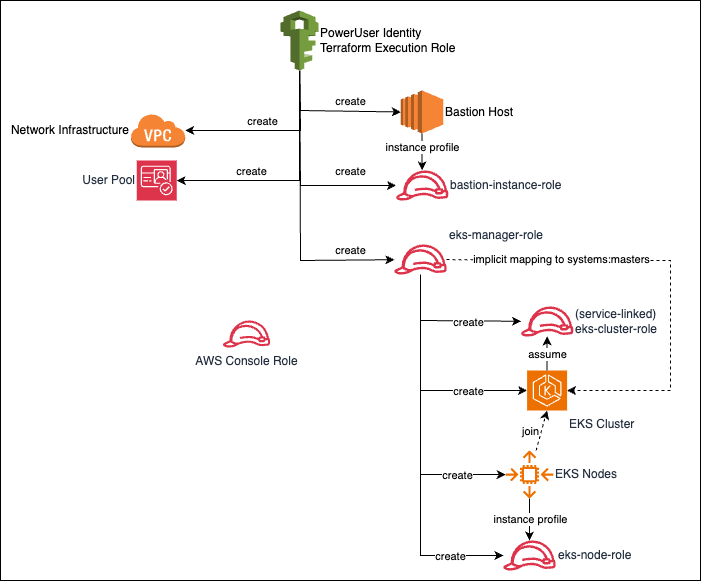

# Cloud Kube - Kubernetes cluster implementations in self-contained Terraform templates 

Most enterprises start with a secure networking foundation known as lanzing zone and build Kubernetes cluster on top of it. For SMBs and startups without such a landing zone looking to create their own Kubernetes clusters, they have to build both their own networking infrastructure and the cluster. CloudKube aims to serve as an opinionated baseline architecture for this purpose. It includes Terraform templates to create a secure, scalable Kubernetes platform on top of basic but secure networking infrastructures.


## EKS (Elastic Kubernetes Services on AWS)
The Terraform template is in the [eks](https://github.com/digihunch/cloudkube/tree/main/eks) directory. It provisions the followings:
- A VPC with four categories of subnets: pubic, internal service, node and pod, each spaning across three AZs;
- A bastion hosts in internal service subnet, with common utilities (kubectl, eksctl, helm) pre-installed and configured.
- An EKS cluster with cluster API endpoint exposed in the private subnet
- Three node groups by default but customizable
- Cognito identity store for authenticating management traffic
- Other resources related to IAM and encryption


### Access to Bastion
The template reads the file `~/.ssh/id_rsa.pub` from where you run the apply command, then add the public key as authorized key on bastion host, as well as EKS nodes. Alternatively, you can specify the public key via the `pubkey_data` input parameter.

User should connect `kubectl` to the cluster from the Bastion host. You may SSH to the bastion host using [Session Manager plugin for AWS CLI](https://docs.aws.amazon.com/systems-manager/latest/userguide/session-manager-working-with-install-plugin.html). Alternatively, you can use the bastion host as a SOCKS5 proxy, and connect with `kubectl` from your local machine via the [SOCKS5 Proxy](https://kubernetes.io/docs/tasks/extend-kubernetes/socks5-proxy-access-api/).


### Identity for kubectl to connect to API server
As stated in the [documentation](https://docs.aws.amazon.com/eks/latest/userguide/add-user-role.html), when you create an Amazon EKS cluster using an IAM entity (e.g. IAM user, role, federated user etc), that IAM entity is automatically (and implicitly) granted `system:masters` permissions in the cluster's role-based access control (RBAC) configuration in the Amazon EKS control plane. This IAM entity does **not** appear in any visible configuration.

In this project, I first create an IAM role `EKS Manager Role` and use it to create EKS cluster. This `EKS Manager Role` is therefore implicitly recongized as having `system:masters` permission for the cluster via Kubernetes RBAC. 

The template then creates an EC2 instace as bastion host. The instance profile of this bastion host is associated with `Basion Instance Role`. As a result, any process that runs on top of AWS SDK on the bastion host, by default assumes the `Bastion Instance Role`, including the `AWS CLI`. On the bastion host, we use the `aws eks update-kubeconfig` command to configure `kubectl` to connect to Kube API. To make this work, we have to tell `AWS CLI`, which start with the `Bastion Instance Role`, to explicitly assume the `EKS Manager Role`. This is handled in the bootstrapping script of the bastion host. As a result, once the bastion host is provisioned, you can just SSH to it and use `kubectl` to connect to the cluster.

This is the reason I do not use an IAM user (instead of the `EKS Manager Role`) to create the EKS cluster because in that case only the IAM user is the implicit master. However I cannot act as the same IAM user on the Bastion host. To troubleshoot what identity `kubectl` is using to access the cluster, turn on Authentication logging and check API access log from CloudWatch.

Apart from the implicit master, we can also configure the cluster to use any OIDC identity provider. The project implements an AWS Cognito user pool as identity provider, with a hard-coded user credential. It then connects the EKS cluster to the Cognito user pool. The project also provide a script you can use to configure kubectl to use the Cognito identity to connect to the cluster. This part is a re-implementation of [this](https://aws.amazon.com/blogs/containers/introducing-oidc-identity-provider-authentication-amazon-eks/) solution in Terraform. 

### Deployment
We can deploy the whole stack with the Terraform triology:
```sh
terraform init
terraform plan
terraform apply
```
Note, if you needs to customize anything using variables, such as node group size and AMI, put the values in `my.tfvars` file and add `-var-file="my.tfvars"` swtich to the end of the plan and apply commands.

It can take up to 30 minutes to create the cluster, at the end, the output will read:
```sh
bastion_info = "i-0bee5f10c7af1f769"
cognito_user_pool = "us-west-2_VmntWU32w"
eks_name = "quality-anchovy-eks-cluster"
```
On the bastion host, you will find the bootstrapping script has already configured kubectl to use the implicit master identity, and prepared the script ([configure_kubectl_cognito_user.sh](https://github.com/digihunch/cloudkube/blob/main/aws/modules/bastion/custom_userdata.sh#L6) in home directory) for you to change kubectl to use Cognito user's identity. Check cloud init script to see what it does and /var/log/cloud-init-out.log for what happened during bootstrapping. 

You can use either identity with kubectl to test cluster functionality. Going into production, to map more IAM users or roles to Kubernetes Roles, follow the [document](https://docs.aws.amazon.com/eks/latest/userguide/add-user-role.html). For example, if your AWS console session does not have visibility to workloads in [EKS resource view](https://aws.amazon.com/blogs/containers/introducing-kubernetes-resource-view-in-amazon-eks-console/), you will need to map the IAM user with appropriate Kubernetes Role. What you can do is look at the `aws-auth` config map in `kube-system` namespace:

```sh
kubectl edit configmap aws-auth -n kube-system
```

If your console uses [account's root user](https://docs.aws.amazon.com/IAM/latest/UserGuide/id_roles_use_switch-role-console.html), you may add the following and save:
```yaml
  mapUsers: |
    - groups:
      - system:masters
      userarn: arn:aws:iam::<root-account-id>:root
      username: root
```
If your console uses an IAM role instead, you may add the following and save.
```yaml
  mapRoles: |
    - groups:
      - system:masters
      rolearn: arn:aws:iam::<account-id>:role/Admin
```
This change takes effect immediately. In production the better way to do this is to have a viewer role and ask console user to assume that role.



Once testing is completed, to tear downt the cluster, destroy the stack:
```sh
terraform destroy
```

If this template is too opinionated and you just need a basic and secure networking foundation, this template in [`vpc-base`](https://github.com/digihunch/vpc-base) provisions the required networking components (e.g. VPC, subnet, etc) and a bastion host. From there, you may use `eksctl` to build cluster on the existing networking, or build a [ROSA](https://docs.openshift.com/rosa/welcome/index.html) cluster.


## Azure Kubernetes Service
The template needs to run by a service principal with sufficient privilege, such as an owner of a target resource group.

The terraform code template is stored in the [azure](https://github.com/digihunch/cloudkube/tree/main/azure) directory. The template was tested with Terraform executable. The cluster created is integrated with Azure AD. To access the API server using kubectl, you will need to be a member of the AD Group, whose object ID is specified as parameter.

Before deployment, run:
```sh
export TF_VAR_ResourceGroup=AutomationTest
export TF_VAR_AdminGroupGUID=74d661ce-cce6-4aed-830d-5abc732a1132
export TF_VAR_cli_cidr_block=$(timeout 2 dig +short myip.opendns.com @resolver1.opendns.com || curl http://checkip.amazonaws.com)/32
```

The value of environment variable TF_VAR_cli_cidr_block will be passed to Terraform as input variable. The Bastion host will open port 22 to any IP address on the CIDR. The dig command gets the public IP of the terminal to run terraform. It the input variable cli_cidr_block is not provided, it defaults to 0.0.0.0/0.

The Terraform template will assign the specified Azure AD group as administrator to the newly created AKS cluster. This activity requires owner permission on the AKS cluster. Since the cluster is not created until the Terraform template is run, we need grant the Azure user owner permisson for the whole resource group.

The Azure AD group that is specified as cluster administrator by UUID, must be a [security-enabled](https://docs.microsoft.com/en-us/graph/api/resources/groups-overview?view=graph-rest-1.0#group-types-in-azure-ad-and-microsoft-graph) AD group. Group type of an AD group can be viewed on Azure portal.

The bastion host will load up a public key fetched from your local environment (~/.ssh/id_rsa.pub). If that is not the public key you want to give out, specify the key value in TF_VAR_pubkey_data.
Then we can login to azure and run terraform from the directory:
```sh
export TF_VAR_cli_cidr_block=$(timeout 2 dig +short myip.opendns.com @resolver1.opendns.com || curl http://checkip.amazonaws.com)/32
# Log in to Azure, If your environment does not have browsers prompted, use --use-device-code switch
az login

# if not on correct subscription by default, set subscription explicitly
az account set --subscription 9xa2z737-0998-2234-91d6-0a39a06xd913

terraform init
terraform plan
terraform apply
```
The cluster creation will take as long as 20 minutes. With the following output:
```sh
bastion_login = "kubeadmin@121.234.84.104"
kube_config = <sensitive>
kubernetes_cluster_name = "kind-macaque-aks_cluster_main"
```

The first result is the username and public IP of bastion host. The kubernetes cluster is on private subnet and its API server is not publicly accessible. The bastion host has network route to the API server and will have kubectl configured automatically. From your environment SSH to the bastion host, and wait until the cloud init process finish configuring kubectl. You can watch the log for cloud init with a tail command and initialize kubelogin
```sh
tail -F /var/log/cloud-init-output.log
kubelogin convert-kubeconfig
```
Since May 2022, we changed to use [kubelogin](https://github.com/Azure/kubelogin) as a helper to kubectl for connection because the azure auth plugin is deprecated in v1.22+ and becomes unavailable in v1.25+. We configured [kubelogin](https://github.com/Azure/kubelogin#device-code-flow-interactive) for interactive login with device code.
Then we can test kubectl access with a command, which should first prompt you to login to Azure with device code:
```sh
kubectl get no
```
Once loggined to Azure from portal. The command should return something like:
```sh
W0506 17:51:17.456782    3900 azure.go:92] WARNING: the azure auth plugin is deprecated in v1.22+, unavailable in v1.25+; use https://github.com/Azure/kubelogin instead.
To learn more, consult https://kubernetes.io/docs/reference/access-authn-authz/authentication/#client-go-credential-plugins
To sign in, use a web browser to open the page https://microsoft.com/devicelogin and enter the code EL2USX792 to authenticate.
NAME                             STATUS   ROLES   AGE     VERSION
aks-sysnp0-19666103-vmss000000   Ready    agent   12m     v1.23.3
aks-wlnp1-17983182-vmss000000    Ready    agent   5m18s   v1.23.3
aks-wlnp1-17983182-vmss000001    Ready    agent   6m28s   v1.23.3
aks-wlnp1-17983182-vmss000002    Ready    agent   5m39s   v1.23.3
```
Once testing is completed, to tear downt the cluster, destroy the stack:
```sh
terraform destroy
```
